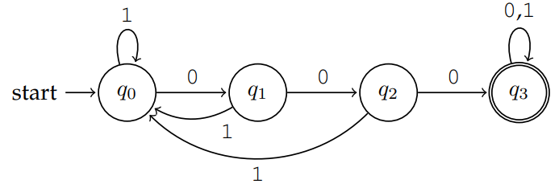

# DFA

This repository contains the implementation of some DFAs in Java.

## What is a DFA?

A **Deterministic Finite State Automaton** (DFA) is a theoretical model of computation used in computer science to represent and recognize patterns within input data. Here are the key components and characteristics of a DFA:

### Components
1. **States**: A finite set of states, including one start state and one or more accept (or final) states.
2. **Alphabet**: A finite set of symbols (input characters) that the automaton can read.
3. **Transition Function**: A function that describes how the automaton moves from one state to another based on the input symbol. For a DFA, this function is deterministic, meaning that for each state and input symbol, there is exactly one transition to another state.
4. **Start State**: The state in which the automaton begins processing input.
5. **Accept States**: States that signify acceptance of the input; if the automaton ends in one of these states after processing the entire input, the input is considered accepted.

### Characteristics
- **Deterministic**: For every state and input symbol, there is exactly one next state. This means there are no ambiguities in how to process input.
- **Finite**: The number of states is finite, making the automaton manageable and predictable.
- **Input Processing**: The DFA reads an input string symbol by symbol, transitioning between states according to the transition function.
- **Acceptance**: A string is accepted by the DFA if, after processing all symbols of the string, the automaton ends in an accept state.

## Example

Consider a simple DFA that recognizes the language of all strings over the alphabet `{0, 1}` that contain three consecutive `0` characters.

The **states** are:
+ $q_0$ (_start_, zero consecutive `0` characters found);
+ $q_1$ (one `0` character found);
+ $q_2$ (two consecutive `0` characters found);
+ $q_3$ (three consecutive `0` characters found).

The _accept_ state is $q_3$.

The **transitions** are:
+ From $q_0$ on input `0` → go to $q_1$
+ From $q_0$ on input `1` → stay in $q_0$
+ From $q_1$ on input `0` → go to $q_2$
+ From $q_1$ on state `1` → go to $q_0$
+ From $q_2$ on state `0` → go to $q_3$
+ From $q_2$ on state `1` → go to $q_0$
+ From $q_3$ on any state → stay in $q_3$

This automaton is implemented in `dfa.ThreeZero` Java class.

## Implementation details

Automata source files are stored into the `src/dfa` folder.
Each automaton is implemented as a separate Java class with a `main` method which passes its first argument to the `scan`
method, and prints whether the string produces a valid accept state.

In the state transitions of the automata only the input character that change the state are shown; the characters that 
keep the state the same are omitted.

The code in the `scan` method will always scan the entire input string (even if a valid accept state that cannot transition
to other invalid states is reached). Moreover, if a character in the string does not belong to the DFA alphabet, a
`InputMismatchException` is thrown.

## Implemented automata

The following DFAs are implemented:
+ `ThreeZero`: checks whether a string does contain three consecutive `'0'` characters.
+ `NotThreeZero`: checks whether a string does not contain three consecutive `'0'` characters.
+ `JavaIdentifier`: checks whether a string is a valid Java identifier.
+ `StudentId`: checks whether a string is a valid student identifier immediately followed by a surname.
+ `StudentIdSpace`: checks whether a string is a valid student identifier followed by a surname, with optional whitespaces before, after and/or in-between.
+ `StudentIdInv`: checks whether a string is a surname immediately followed by a valid student identifier.
+ `LastThreeA`: checks whether the last three characters of a string contains at least an `'a'` character.
+ `NameMinusOne`: checks whether a string is composed by a name (passed as the second argument) with at most one letter replaced.
+ `FloatingPoint`: checks whether a string represents a floating point number, with optional sign and exponent.
+ `BlockComment`: checks whether a string represents a block-comment (delimited by `"/*"` and `"*/"`), without nesting.
+ `ContainsBlockComment`: checks whether a string does not contain any comment, or contains a valid block comment.

More information about the purpose of each DFA is included in the class documentation comments.